<!-- ===================== HEADER ===================== -->

 

<!-- ===================== SOCIAL LINKS ===================== -->

 

<!-- ===================== ABOUT ===================== -->

<h2>&nbsp; About Me</h2>

I am a software engineer from Fiji who enjoys building reliable, practical and user-friendly digital systems.

&nbsp; Working as an <strong>Online Systems Engineer at Counterpoint Group</strong>

&nbsp; Building <strong>CPVMS</strong>, an integration platform connecting booking and POS systems with FRCS TaxCore

&nbsp; Working with <strong>Google Cloud Platform, Cloud Run, APIs and system integrations</strong>

&nbsp; Exploring <strong>AI chatbots, Gemini and intelligent decision-support systems</strong>

&nbsp; Interested in <strong>AI, cybersecurity and Pacific-focused technology</strong>

&nbsp; Enjoy full-stack development, game development and interactive applications

&nbsp; I debug code faster when coffee is involved

 

---

<!-- ===================== CURRENT FOCUS ===================== -->

<h2>&nbsp; Current Focus</h2>

&nbsp; Cloud-native application development

&nbsp; Payment, booking and government-system integrations

&nbsp; AI-powered assistants and automation

&nbsp; Cybersecurity and digital safety platforms

&nbsp; Technology designed for Fiji and the Pacific

---

<!-- ===================== TECHNOLOGIES ===================== -->

<h2>
&nbsp; Technology Stack
</h2>

### Languages

### Frontend and Full-Stack Development

### Backend, Cloud, DevOps and Hosting

### Databases and Development Tools

### Testing, 3D and Game Development

---

<!-- ===================== GITHUB STATISTICS ===================== -->

<h2>&nbsp; GitHub Statistics</h2>

 

---

<!-- ===================== FEATURED PROJECTS HEADER ===================== -->

 

 

From early static websites to production cloud integrations, university systems,
AI platforms and interactive 3D experiences.

---
<!-- ===================== PROJECTS ===================== -->
<h2>&nbsp; Portfolio Evolution</h2>

<table>
<tr>
<td width="33%" align="center" valign="top">
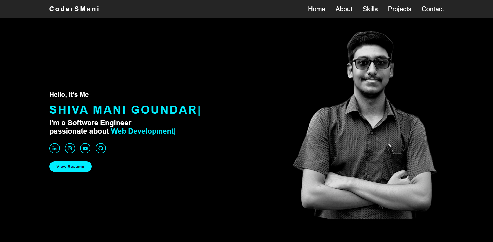
<h3>Portfolio V1</h3>

My first simple personal portfolio built with core web technologies.

  

</td>

<td width="33%" align="center" valign="top">
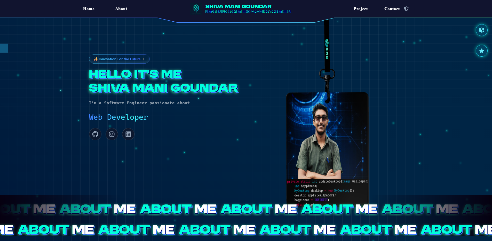
<h3>Portfolio V2</h3>

A modern full-stack portfolio with dynamic content and backend services.

  

</td>

<td width="33%" align="center" valign="top">
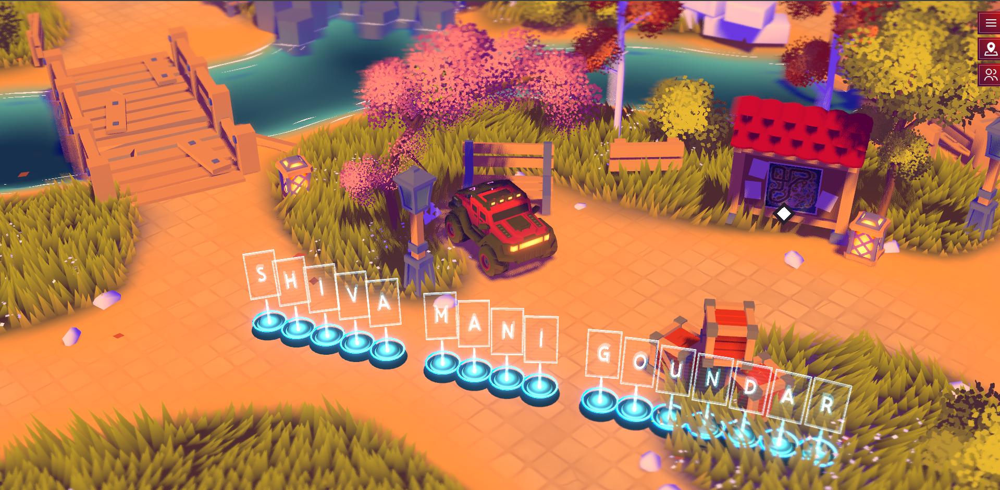
<h3>Portfolio V3</h3>

An interactive multiplayer 3D world where visitors explore my projects.

  

</td>
</tr>
</table>

---

<!-- ===================== UNIVERSITY PROJECTS ===================== -->

<h2>&nbsp; University Projects</h2>

<table>
<tr>

<td width="50%" align="center" valign="top">

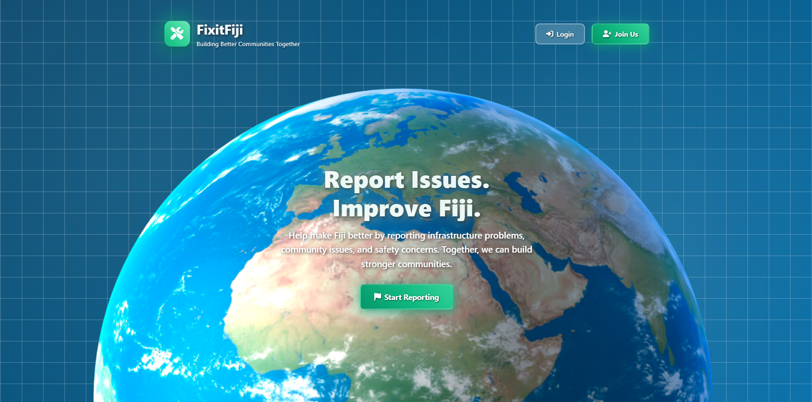

<h3>&nbsp; FixIt Fiji</h3>

A community issue-reporting platform that allows people to report public problems such as stray dogs, damaged roads, broken pipes and other local infrastructure concerns.

Reports can include issue information and location details, helping responsible organizations identify, review and respond to community problems more efficiently.

  

</td>

<td width="50%" align="center" valign="top">

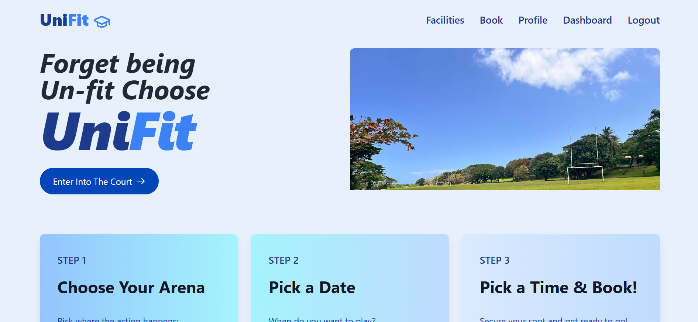

<h3>&nbsp; Sports Facility Management System</h3>

A centralized platform for discovering and booking sports facilities while viewing upcoming sporting activities, competitions and community events.

The system helps users check facility availability, make bookings and stay informed about scheduled events through one organized platform.

  

</td>

</tr>
</table>

---

<h2>&nbsp; Personal Projects</h2>

<table>
<tr>
<td width="50%" align="center" valign="top">
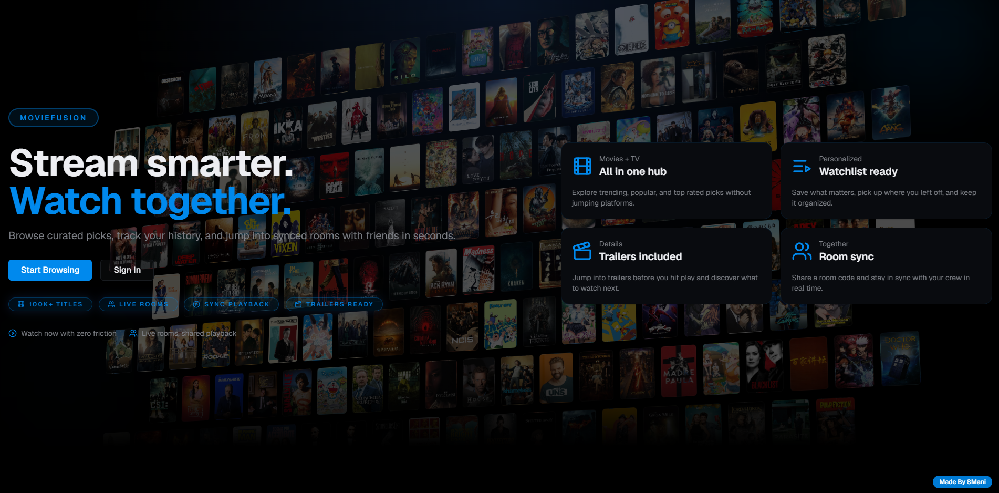
<h3>&nbsp; MovieFusion</h3>

Movie discovery, streaming and synchronized watch-together platform.

  

</td>

<td width="50%" align="center" valign="top">
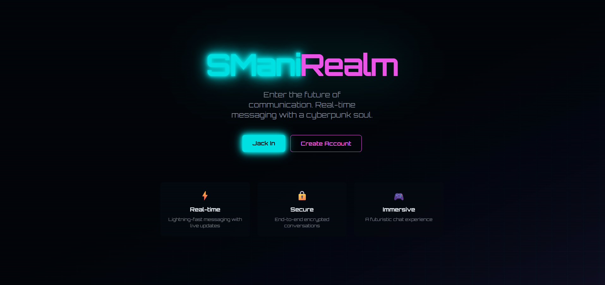
<h3>&nbsp; Neon Chat</h3>

A Discord-inspired communication platform with real-time conversations.

  

</td>
</tr>

<tr>
<td width="50%" align="center" valign="top">
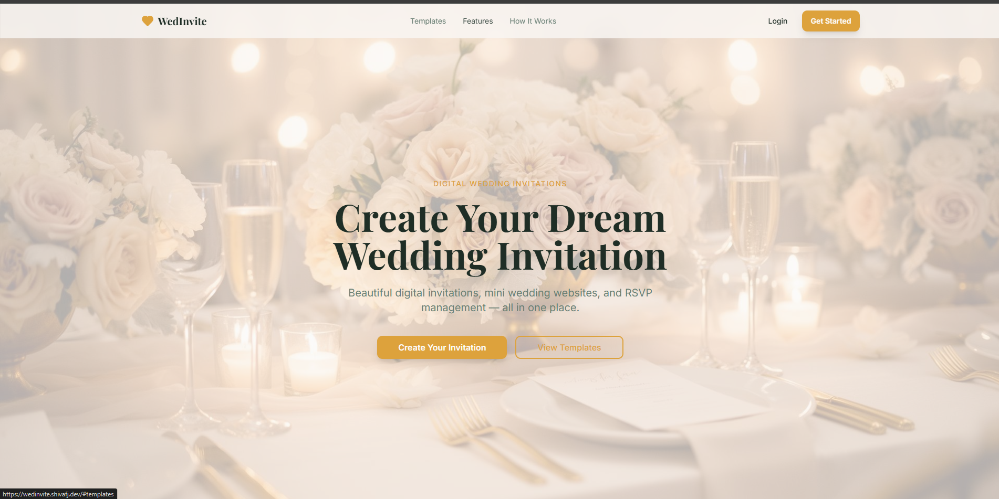
<h3>&nbsp; WedInvite</h3>

A platform for creating and sharing personalized digital wedding invitations.

  

</td>

<td width="50%" align="center" valign="top">
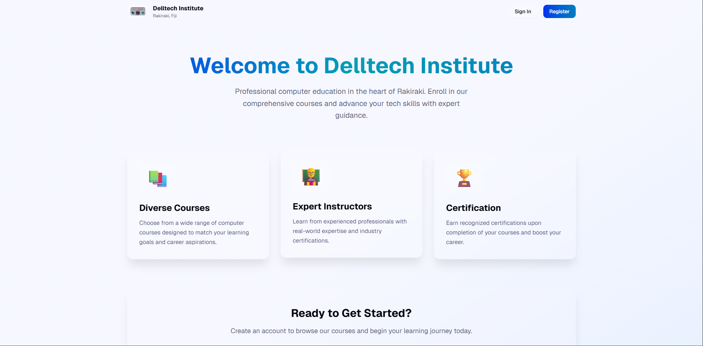
<h3>&nbsp; Education Management Platform</h3>

Student recruitment, learning management, results and certificate generation.

  

</td>
</tr>

<tr>
<td width="50%" align="center" valign="top">
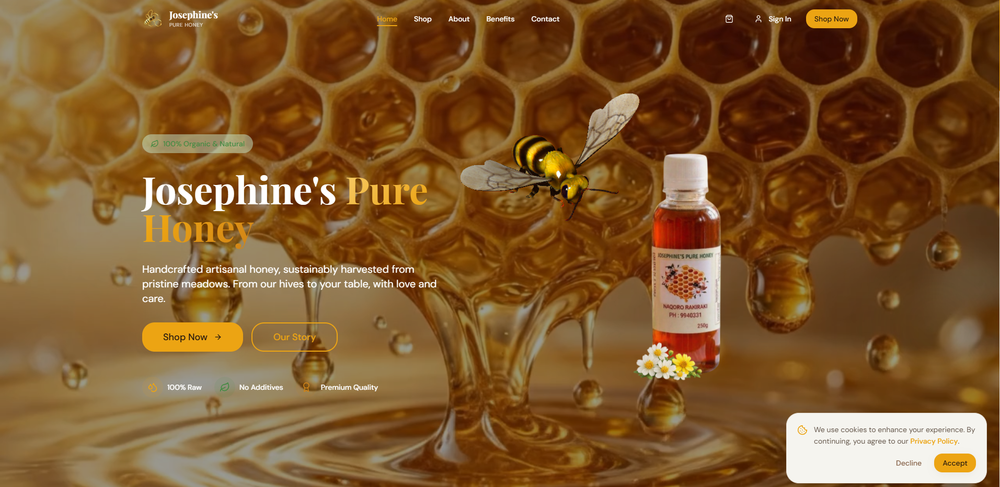
<h3>&nbsp; Honey Store</h3>

A complete e-commerce website for browsing and purchasing honey products.

  

</td>

<td width="50%" align="center" valign="top">
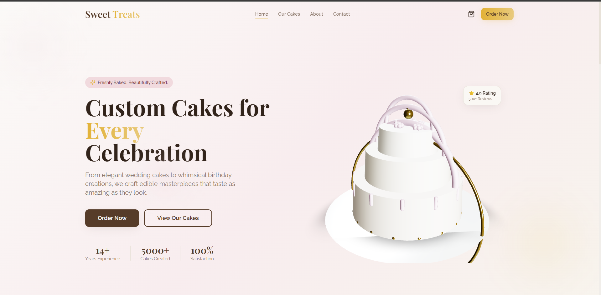
<h3>&nbsp; Cake Store</h3>

An online cake catalogue and ordering platform with a visual shopping experience.

  

</td>
</tr>

<tr>
<td width="50%" align="center" valign="top">
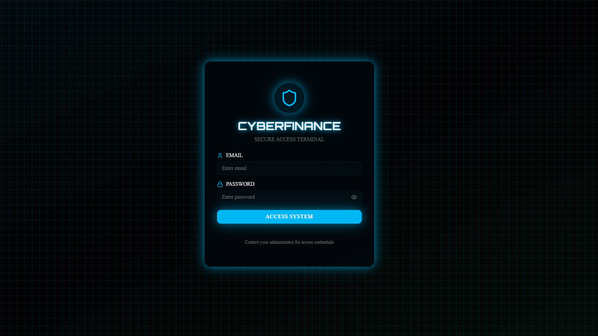
<h3>&nbsp; Cyber Finance</h3>

A personal budgeting application for tracking income, expenses and spending activity.

  

</td>

<td width="50%" align="center" valign="top">
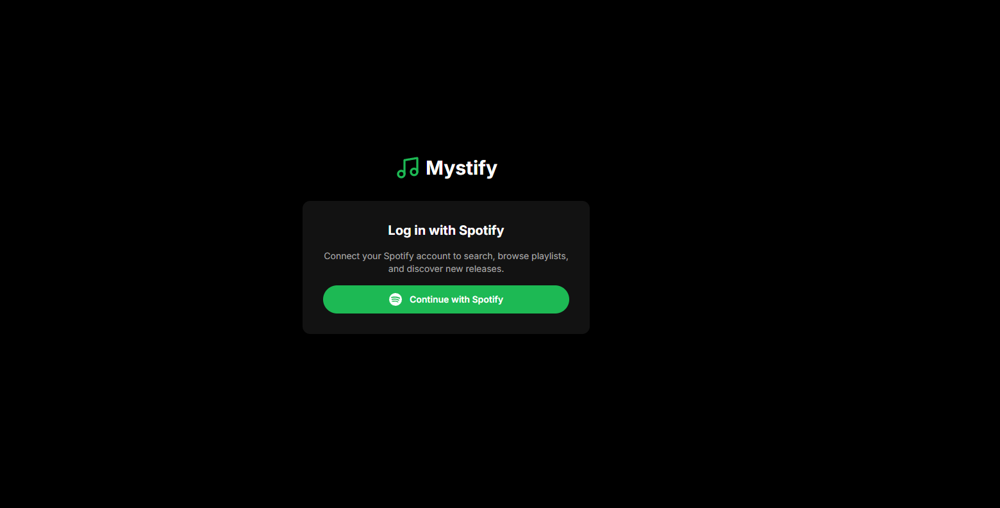
<h3>&nbsp; Mystify</h3>

A music streaming platform focused on discovery, playlists and a modern listening experience.

  

</td>
</tr>
</table>

---

<h2>&nbsp; Professional Projects</h2>

<table>
<tr>
<td width="50%" align="center" valign="top">

<h3>&nbsp; CPVMS — Hotel Link</h3>

Middleware integration connecting Hotel Link booking and payment data with FRCS TaxCore.

</td>

<td width="50%" align="center" valign="top">
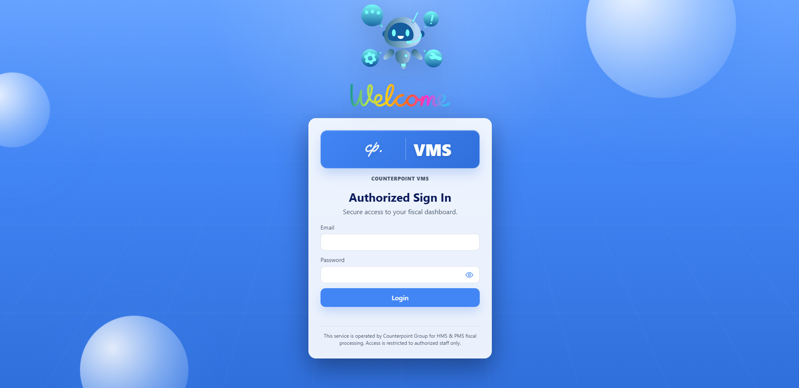
<h3>&nbsp; CPVMS — AbodeBooking</h3>

Webhook-driven booking, payment and fiscalisation integration for AbodeBooking.

</td>
</tr>

<tr>
<td width="50%" align="center" valign="top">
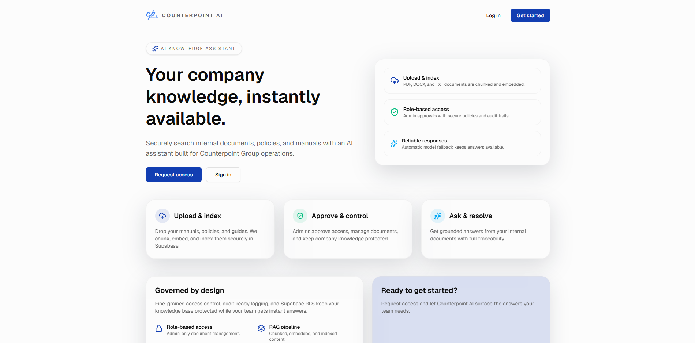
<h3>&nbsp; Internal CP AI Assistant</h3>

An internal AI assistant for company knowledge, staff support and workflow automation.

</td>

<td width="50%" align="center" valign="top">
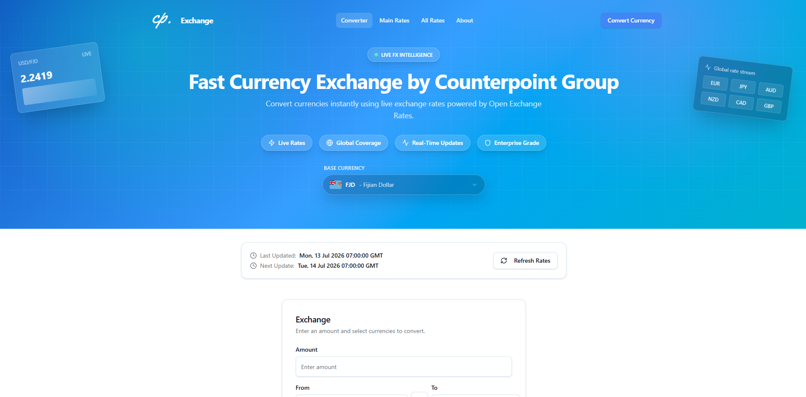
<h3>&nbsp; CPVMS Currency Exchange</h3>

An FJD-based currency conversion platform using live exchange-rate data.

  

</td>
</tr>

<tr>
<td width="50%" align="center" valign="top">
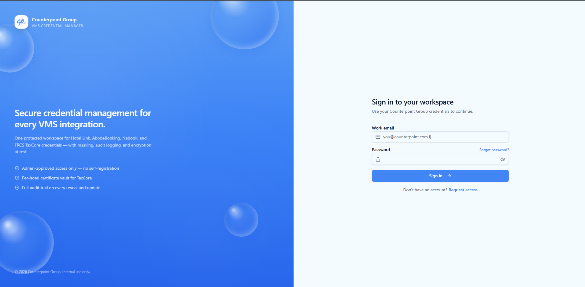
<h3>&nbsp; CPVMS Credential Manager</h3>

A secure system for managing integration credentials, API keys and FRCS certificates.

</td>

<td width="50%" align="center" valign="top">
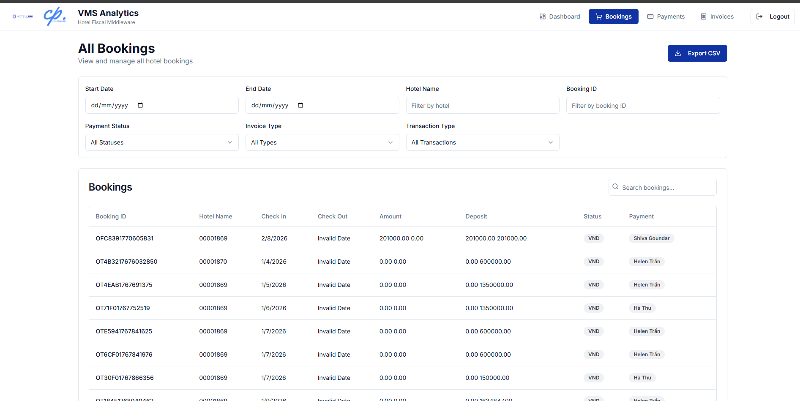
<h3>&nbsp; CPVMS Analytics</h3>

A historical analytics platform for fiscalisation activity, transactions and system performance.

</td>
</tr>
</table>

---

<h2>&nbsp; Hackathon Projects</h2>

<table>
<tr>
<td width="33%" align="center" valign="top">
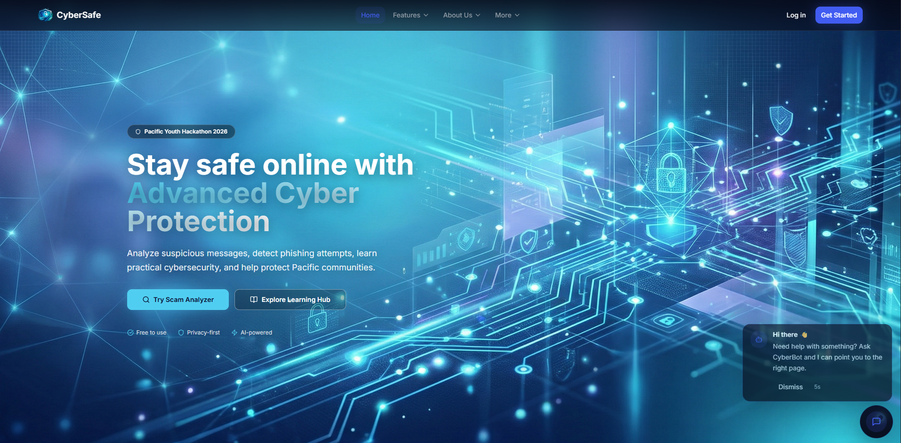
<h3>&nbsp; Cyber Safe</h3>

Pacific-focused scam detection, cybersecurity learning and reporting.

  

</td>

<td width="33%" align="center" valign="top">
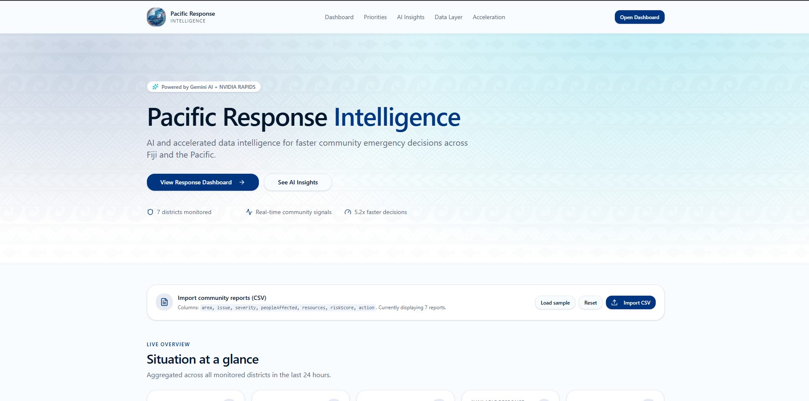
<h3>&nbsp; Pacific Response Intelligence</h3>

GPU-accelerated emergency risk scoring and decision intelligence.

  

</td>

<td width="33%" align="center" valign="top">
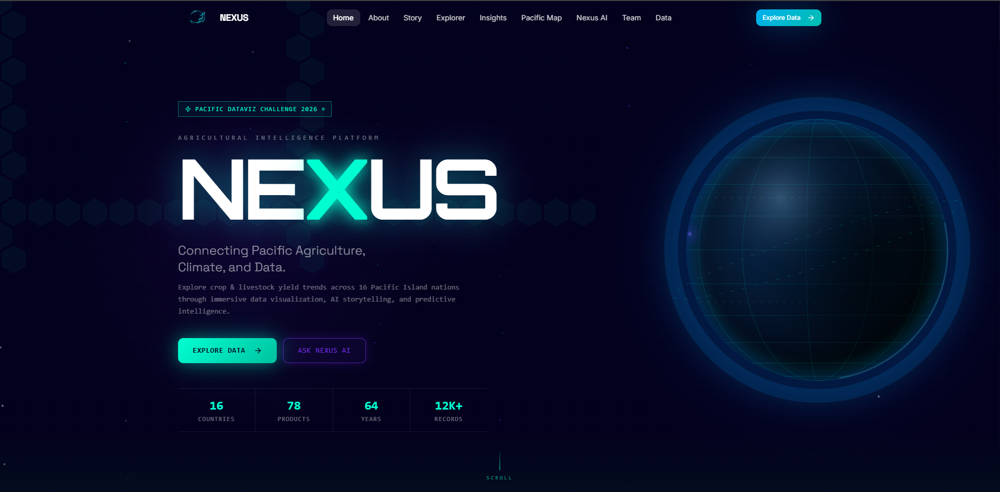
<h3>&nbsp; NEXUS</h3>

Pacific crop and livestock data visualization and intelligence platform.

  

</td>
</tr>
</table>

---

<h3>&nbsp; More Projects Are Always Being Built</h3>

---

<!-- ===================== CONTRIBUTION ANIMATION ===================== -->

<h2>&nbsp; Contribution Arcade</h2>

<picture>
<source media="(prefers-color-scheme: dark)" srcset="https://raw.githubusercontent.com/SMani0547/SMani0547/output/pacman-contribution-graph-dark.svg">
<source media="(prefers-color-scheme: light)" srcset="https://raw.githubusercontent.com/SMani0547/SMani0547/output/pacman-contribution-graph.svg">

</picture>

 

<strong>&nbsp; View Snake Contribution Animation</strong>

 

<picture>
<source media="(prefers-color-scheme: dark)" srcset="https://raw.githubusercontent.com/SMani0547/SMani0547/output/snake-dark.svg">
<source media="(prefers-color-scheme: light)" srcset="https://raw.githubusercontent.com/SMani0547/SMani0547/output/snake.svg">

</picture>

---

 

 

<!-- ===================== CONTACT ===================== -->

<h2>Let’s Build Something Meaningful</h2>

Have a project, integration or collaboration idea? 
Send me a message and I’ll get back to you.

  

